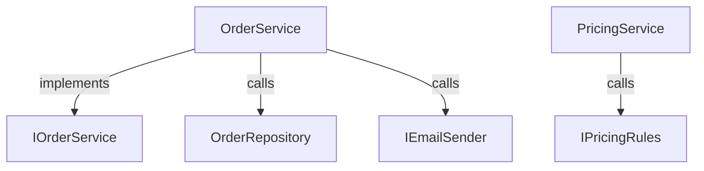
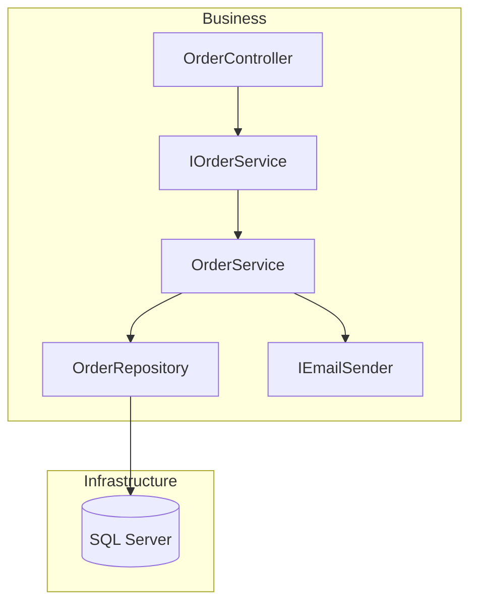

# 03 — CLI Implementation Plan

Component: **`arch` CLI** (Architecture Intelligence Platform)
Status: Draft
Depends on (integration points, designed in parallel docs): `01-architecture-scanner.md` (Architecture Scanner), `02-graph-store.md` (Graph Store), incremental watcher doc (numbered later in the series — see §9 open questions on numbering). This document treats those components as black boxes accessed through abstractions and does not redefine their contracts.

---

## 1. Overview & Responsibilities

The CLI is the primary local entry point to the Architecture Intelligence Platform. It is a **thin orchestration layer**: it owns no domain logic of its own (no scanning algorithm, no graph traversal algorithm, no diffing algorithm). Its job is to:

* Parse command-line input into strongly typed commands.
* Load and validate the project's `arch.yml` configuration.
* Resolve and invoke the correct backend service through dependency injection (Scanner, Graph Reader, Watcher, future Cloud Sync client).
* Format results for a human (table/tree/colored text) or a machine (JSON/YAML/Mermaid/exit codes) consumer.
* Provide a good local developer experience: fast startup, helpful errors, `--help` everywhere, sensible defaults, non-zero exit codes on failure so it composes in CI and scripts.
* Bootstrap and supervise long-running local processes (the incremental watcher, the local REST API + dashboard) that other components implement.

Explicitly **not** the CLI's job:

* Roslyn/MSBuild parsing logic — owned by the Architecture Scanner.
* Graph persistence, querying, or schema — owned by the Graph Store.
* File-system watching/debouncing logic — owned by the Incremental Watcher.
* Dashboard rendering — owned by the Next.js app; the CLI only launches/points to it.

The CLI is the first component end users touch, and for Phase 1 it is effectively the *whole product* (`init` → `scan` → `graph`). It therefore needs to feel finished even when the rest of the platform (dashboard, REST API, cloud) does not exist yet.

### Integration assumption (called out explicitly)

The CLI depends on the following abstractions, whose concrete contracts are owned by other implementation-plan documents and are **assumed**, not designed, here:

```csharp
// Owned by 01-architecture-scanner.md
public interface IArchitectureScanner
{
    Task<ScanResult> ScanAsync(ScanOptions options, IProgress<ScanProgress>? progress, CancellationToken ct);
}

// Owned by 02-graph-store.md
public interface IGraphReader
{
    Task<NodeDto?> GetNodeAsync(string nameOrId, CancellationToken ct);
    Task<IReadOnlyList<EdgeDto>> GetDependenciesAsync(string nodeId, GraphTraversalOptions options, CancellationToken ct);
    Task<IReadOnlyList<EdgeDto>> GetCallersAsync(string nodeId, GraphTraversalOptions options, CancellationToken ct);
    Task<ImpactResult> GetImpactAsync(string nodeId, ImpactOptions options, CancellationToken ct);
    Task<GraphSnapshot> GetGraphAsync(GraphQuery query, CancellationToken ct);
    Task<MetricsReport> GetMetricsAsync(MetricsOptions options, CancellationToken ct);
    Task<IReadOnlyList<CircularDependency>> GetCircularDependenciesAsync(CancellationToken ct);
}

// Owned by incremental-watcher doc
public interface IIncrementalWatcher
{
    Task RunAsync(WatchOptions options, IWatchEventSink sink, CancellationToken ct);
}
```

The CLI project takes a compile-time dependency on the NuGet packages that ship these interfaces (e.g. `Arch.Scanner.Abstractions`, `Arch.GraphStore.Abstractions`, `Arch.Watcher.Abstractions`) and wires concrete implementations through `Microsoft.Extensions.DependencyInjection`. If those packages are not yet available when CLI work starts, the CLI team should build against hand-rolled interfaces matching the shapes above and swap in the real packages once published — this is the single biggest cross-team risk for this component (see §9).

---

## 2. Phase-by-Phase Scope

Every command from the README's CLI section, mapped to the roadmap phase it belongs to, plus new commands proposed to fill gaps (especially Phase 2's `serve` and Phase 4's collaboration commands, which the README implies but does not name explicitly as CLI verbs).

| Command | Phase | Status in README | Notes |
|---|---|---|---|
| `arch init` | 1 | Named | Scaffold `arch.yml` config |
| `arch scan` | 1 | Named | Full solution scan → Graph Store |
| `arch graph` | 1 (basic) → 2 (rich) | Named | Phase 1: text/JSON. Phase 2: filters, Mermaid, feeds dashboard |
| `arch doctor` | 1 | Named | Environment/config health check — needed early to unblock adoption |
| `arch mcp` | 1 | Implied ("Basic MCP server") | New — bootstraps/serves the MCP server process; not named in README but required to satisfy "Basic MCP server" roadmap item from the CLI side |
| `arch diagram` | 2 | Named | Mermaid export in Phase 2; richer formats later |
| `arch serve` | 2 | New (proposed) | Launches local REST API + dashboard together, per README's "Next.js dashboard" + "REST API" Phase 2 items |
| `arch watch` | 3 | Named | Incremental rebuild, live graph updates |
| `arch metrics` | 3 | Named | Coupling analysis, complexity, architecture quality signals |
| `arch impact` | 3 | Named | Impact analysis, richer in Phase 3 (AI planner-adjacent) but usable read-only from Phase 1's stored graph in a degraded form — see note below |
| `arch callers` | 3 | Named | Reverse-dependency lookup |
| `arch explain` | 3 | Named | Human/AI-readable summary of a symbol, backed by AI implementation planner work |
| `arch plan` | 3 | New (proposed) | CLI front door to the "AI implementation planner" roadmap item (`Implement Archive Model` style prompt) |
| `arch login` | 4 | New (proposed) | Authenticate CLI against cloud account (Better Auth / GitHub OAuth / Entra ID) |
| `arch push` | 4 | New (proposed) | Upload local graph snapshot to cloud for team sharing |
| `arch pull` | 4 | New (proposed) | Download latest team/cloud graph snapshot |
| `arch snapshot` | 4 | New (proposed) | Create/list/diff named historical architecture snapshots (local or cloud) |
| `arch repo add/remove/list` | 4 | New (proposed) | Multi-repository registration for cross-repo graphs |
| `arch score` | 4 | New (proposed) | Architecture quality scoring, per Phase 4 roadmap item |

Note on `impact`/`callers`/`explain` appearing "early" in Phase 1 graphs: since `arch scan` already populates a queryable graph in Phase 1, nothing prevents `impact`/`callers` from technically running against a Phase 1 database. The roadmap, however, explicitly assigns "Impact analysis" to Phase 2 and full "circular dependency detection" style depth to Phase 3, so this plan keeps the *commands* stubbed-but-hidden (or marked experimental) until their backing analysis is considered complete, to avoid shipping a command whose output quality regresses expectations. Concretely:

* Phase 1: commands exist in code as no-ops or return `"not yet supported, coming in Phase 2/3"` with exit code 2, OR are simply not registered yet (recommended — cleaner UX, see §3).
* Phase 2: `impact` becomes real (basic transitive closure), `callers` becomes real.
* Phase 3: `impact`/`callers` gain depth control, filtering, circular-dependency warnings; `explain` and `plan` ship.

### Phase summary

**Phase 1 — Foundation**
`init`, `scan`, `graph` (text/JSON), `doctor`, `mcp` (bootstrap only).

**Phase 2 — Visualization**
`diagram` (Mermaid), `graph` gains `--format mermaid`, richer filters (`--project`, `--depth`, `--type`), `serve` (REST API + dashboard), `impact` and `callers` promoted from stub to real (basic).

**Phase 3 — Intelligence**
`watch`, `metrics`, `impact`/`callers` full depth + circular dependency warnings, `explain`, `plan`.

**Phase 4 — Collaboration & Scale**
`login`, `push`, `pull`, `snapshot`, `repo add|remove|list`, `score`, plus multi-repo-aware variants of `graph`/`impact`/`metrics` (`--repo` flag).

---

## 3. CLI Framework & Technical Design

### 3.1 Framework choice: `System.CommandLine`

Recommendation: **`System.CommandLine`** (the modern Microsoft library, `System.CommandLine` + `System.CommandLine.NamingConventionBinder`/hosting extensions), not a third-party framework like Spectre.Console.Cli or CliFx, with **Spectre.Console** layered on top purely for rendering (tables, trees, progress bars, colored output).

Justification:

* **First-party, long-term supported.** It is the framework the .NET SDK itself (`dotnet` CLI) is migrating to; aligning with it reduces the risk of picking a library that stalls.
* **Strong typing and testability.** Commands, options, and arguments are declared as objects with parsers/validators; handlers can be plain methods/delegates that are unit-testable without spinning up a process.
* **Built-in `--help`, suggestions, tab completion.** Free "did you mean" suggestions on typos (`arch grpah` → suggests `graph`), and dotnet-suggest-based shell completion (bash/zsh/PowerShell) out of the box — important for a tool meant to be typed dozens of times a day.
* **Composable middleware pipeline.** Global options like `--verbosity`, `--config`, `--no-color`, `--json` can be injected once via middleware rather than repeated per command.
* **Good DI integration.** Combines cleanly with `Microsoft.Extensions.Hosting`'s `HostBuilder`, letting the CLI reuse the same DI container patterns as the rest of the .NET backend (Scanner, Graph Store, Watcher all likely built on `Microsoft.Extensions.*` already per the Tech Stack section).
* **Spectre.Console add-on, not replacement.** Spectre.Console's `Spectre.Console.Cli` is a fine alternative, but its own command-model would compete with `System.CommandLine` for parsing responsibilities. Instead we use `System.CommandLine` for parsing/binding/help/completion and `Spectre.Console` purely as a rendering library (tables, trees, panels, progress bars, markup) inside command handlers. This gets the best of both without two competing app models.

### 3.2 Command structure

Root command: `arch`. Verbs are direct subcommands (not nested groups) to match the README's flat command list, except where Phase 4 naturally wants noun-verb grouping (`repo add`, `repo list`).

```
arch
├── init
├── scan
├── watch
├── graph
│   └── [nodeId]                  (positional, optional — scoped subgraph)
├── explain <symbol>
├── impact <symbol>
├── callers <symbol>
├── diagram <scope>
├── metrics
├── doctor
├── mcp
│   ├── start
│   └── status
├── serve                          (Phase 2)
├── plan <prompt>                  (Phase 3)
├── login                          (Phase 4)
├── push                           (Phase 4)
├── pull                           (Phase 4)
├── snapshot
│   ├── create
│   ├── list
│   └── diff <a> <b>               (Phase 4)
├── repo
│   ├── add <path>
│   ├── remove <name>
│   └── list                       (Phase 4)
└── score                          (Phase 4)
```

### 3.3 Global options (apply to every command via middleware)

| Option | Alias | Description | Default |
|---|---|---|---|
| `--config <path>` | `-c` | Path to `arch.yml` | discovery, see §5 |
| `--format <table|json|yaml|mermaid|plain>` | `-f` | Output format | `table` (TTY) / `json` (non-TTY, see below) |
| `--verbosity <quiet|minimal|normal|detailed|diagnostic>` | `-v` | Logging verbosity | `normal` |
| `--no-color` | | Disable ANSI styling | auto-detected from `NO_COLOR` env var / redirected output |
| `--no-input` | | Fail instead of prompting interactively | `false` |
| `--cwd <path>` | | Run as if invoked from this directory | current directory |
| `--quiet` / `-q` | | Suppress non-essential output; still prints machine output | `false` |

**TTY-aware default format**: when stdout is redirected/piped (not a TTY), default to `json` instead of `table` so `arch graph | jq .` works without needing `--format json` every time. This mirrors GitHub CLI (`gh`) conventions. `table` remains the default for interactive terminal usage because it's more readable for humans.

### 3.4 Output formatting

A shared `IOutputWriter` abstraction is injected into every command handler:

```csharp
public interface IOutputWriter
{
    void WriteTable(TableData data);
    void WriteTree(TreeNode root);
    void WriteObject<T>(T value);          // serializes as json/yaml per selected format
    void WriteMermaid(string mermaidSource);
    void WriteRaw(string text);
    void WriteError(string message, Exception? ex = null);
    IProgressHandle StartProgress(string label);
}
```

Implementations:
* `TableOutputWriter` (Spectre.Console tables/trees, colorized) — used when `--format table`.
* `JsonOutputWriter` (`System.Text.Json`, camelCase, indented when TTY, compact when piped) — used when `--format json`.
* `YamlOutputWriter` (`YamlDotNet`) — used when `--format yaml`.
* `MermaidOutputWriter` — raw Mermaid text passthrough, used by `diagram` and `graph --format mermaid`.

Every command's handler produces a single internal DTO (e.g. `GraphResultDto`) and hands it to `IOutputWriter`; the handler never branches on format itself. This keeps format-specific rendering centralized and means adding a new format (e.g. `dot`/Graphviz later) touches one class, not every command.

### 3.5 Exit codes

Consistent, script-friendly exit codes across all commands:

| Code | Meaning |
|---|---|
| 0 | Success |
| 1 | Unhandled/unexpected error |
| 2 | User error — invalid arguments, symbol not found, command not yet implemented for this phase |
| 3 | Configuration error — `arch.yml` missing/invalid, solution file not found |
| 4 | Environment error — MSBuild locator failed, DB unreachable, dependency missing (surfaced primarily via `doctor` but reusable) |
| 5 | Scan/analysis failed partway (partial results may still have been written; see scan resilience notes in §4) |
| 10 | Cloud/auth error (Phase 4) — not logged in, sync conflict, network unreachable |

These are documented in `arch <command> --help` footers and in a top-level `docs/exit-codes.md` (future) so CI pipelines (e.g. "fail the build if `arch impact` reports > N affected projects") can rely on them.

### 3.6 Logging & verbosity

Built on `Microsoft.Extensions.Logging`, with a console provider whose sink is Spectre.Console (so log lines and rendered tables share the same color theme). `--verbosity diagnostic` enables logging of the underlying Scanner/Graph Store calls (timings, SQL/Cypher-ish queries if applicable) for debugging integration issues — critical during early integration with the Scanner/Graph Store components since those contracts are still being finalized in parallel.

### 3.7 Configuration & DI bootstrap

`Program.cs` builds a `Microsoft.Extensions.Hosting.Host` with:
1. Config binding (`arch.yml` → strongly typed `ArchConfig`, see §5).
2. Registration of `IArchitectureScanner`, `IGraphReader`, `IIncrementalWatcher` implementations (resolved from the referenced NuGet packages; swappable for fakes in tests).
3. Registration of `IOutputWriter` based on parsed global `--format`.
4. `System.CommandLine`'s `CommandLineBuilder` wired to use this `IHost`'s `IServiceProvider` for handler construction (via `UseHost` extension or manual `InvocationContext.BindingContext` resolution).

This means every command handler is a small class with constructor-injected dependencies (`IGraphReader graphReader, IOutputWriter output, ILogger<ImpactCommand> logger`), making handlers directly unit-testable without invoking the parser at all.

---

## 4. Command Reference

For each command: purpose, arguments/options, example usage/output, and which backend interface it calls.

### `arch init`

**Purpose**: Scaffold a new `arch.yml` in the current (or `--path`) directory, auto-detecting the solution file if possible.

**Options**:
| Option | Description |
|---|---|
| `--path <dir>` | Target directory (default: cwd) |
| `--solution <file>` | Explicit `.sln` path; if omitted, CLI globs for a single `*.sln` and prompts if multiple/none found |
| `--force` | Overwrite existing `arch.yml` |
| `--minimal` | Emit a bare-bones config without inline comments |

**Backend**: none (pure file-system operation); may call a lightweight `ISolutionDiscovery` helper shared with `doctor`.

```bash
$ arch init
? Multiple solution files found. Select one:
  > PatternVision.sln
    PatternVision.Legacy.sln
✔ Detected 6 projects referencing "Common", "Domain", "Application", "Infrastructure", "API", "Tests"
✔ Wrote arch.yml

Next steps:
  arch scan     # build the architecture graph
  arch doctor   # verify your environment is ready
```

Generated `arch.yml` (see §5 for full schema) is pre-populated with a best-guess `scanOrder` derived from project-reference topology so users get a working config on day one without hand-editing.

### `arch scan`

**Purpose**: Perform a full solution scan, populating/replacing the Graph Store.

**Options**:
| Option | Description |
|---|---|
| `--config <path>` | Override config discovery |
| `--project <name>` | Scan only a subset of projects (repeatable) |
| `--no-cache` | Ignore any incremental cache and force a full rebuild |
| `--fail-on-warning` | Exit non-zero if the scanner reports warnings (unresolved references, etc.) — useful in CI |
| `--output-summary <path>` | Write a JSON scan summary to a file in addition to stdout |

**Backend**: `IArchitectureScanner.ScanAsync(ScanOptions, IProgress<ScanProgress>, ct)`. The CLI subscribes to `IProgress<ScanProgress>` to drive a Spectre.Console progress bar with per-project status.

```bash
$ arch scan
Scanning PatternVision.sln
  [1/6] Common          ████████████████████ done  (0.4s)
  [2/6] Domain          ████████████████████ done  (0.8s)
  [3/6] Application     ████████████████████ done  (2.1s)
  [4/6] Infrastructure   ████████████████████ done  (3.4s)
  [5/6] API             ████████████████████ done  (1.2s)
  [6/6] Tests           ████████████████████ done  (1.9s)

Scan complete in 9.8s
  2,350 classes, 184 interfaces, 412 methods indexed
  0 errors, 3 warnings (unresolved references — run with --verbosity detailed)

Graph written to .arch/graph.db
```

Machine format:

```bash
$ arch scan --format json --quiet
{"status":"success","durationMs":9812,"projects":6,"classes":2350,"interfaces":184,"warnings":3,"errors":0}
```

Exit code 5 (scan failed partway) is used when the scanner reports `ScanResult.Status == Partial`; the CLI still prints whatever partial summary is available and clearly labels it as partial.

### `arch graph`

**Purpose**: Query and render the dependency graph, in full or scoped to a node.

**Arguments/Options**:
| Arg/Option | Description |
|---|---|
| `[node]` (positional, optional) | Scope the graph to this node's neighborhood |
| `--depth <n>` | Traversal depth from `node` (default `2`) |
| `--project <name>` | Filter to a project (repeatable) |
| `--type <class|interface|service|controller|...>` | Filter by node kind (repeatable) |
| `--format <table|json|yaml|mermaid>` | Output format (Phase 1: table/json; Phase 2 adds mermaid) |
| `--exclude-tests` | Omit test projects/classes |

**Backend**: `IGraphReader.GetGraphAsync(GraphQuery, ct)`.

Phase 1 (basic text):

```bash
$ arch graph --project Business
Business (project)
├── OrderService              → implements IOrderService
│   ├── depends on OrderRepository
│   └── depends on IEmailSender
└── PricingService
    └── depends on IPricingRules
```

```bash
$ arch graph --project Business --format json
{
  "nodes": [
    {"id": "Business.OrderService", "kind": "class", "project": "Business"},
    {"id": "Business.IOrderService", "kind": "interface", "project": "Business"}
  ],
  "edges": [
    {"from": "Business.OrderService", "to": "Business.IOrderService", "type": "implements"},
    {"from": "Business.OrderService", "to": "Infrastructure.OrderRepository", "type": "calls"}
  ]
}
```

Phase 2 (Mermaid):

```bash
$ arch graph --project Business --format mermaid
```


### `arch explain <symbol>` (Phase 3)

**Purpose**: Human/AI-readable narrative summary of a class/interface/service — its role, dependencies, callers, and related tests.

**Options**: `--depth <n>`, `--format <table|json|markdown>`.

**Backend**: `IGraphReader.GetNodeAsync` + `GetDependenciesAsync` + `GetCallersAsync`, composed by a `ExplainCommand` handler (the "explanation" itself is templated/composed by the CLI or by the AI planner service, depending on final design — see open question in §9).

```bash
$ arch explain OrderService
OrderService (Business.Services.OrderService)
  Implements: IOrderService
  Depends on: OrderRepository, IEmailSender, IPricingRules
  Used by: OrderController, OrderBackgroundWorker
  Tests: OrderServiceTests (12 tests, last run: passing)

Summary:
  OrderService coordinates order creation and coordinates pricing
  and email notification. It is called from the API layer and from
  a background worker; changes here affect 2 direct callers and
  3 downstream dependencies.
```

### `arch impact <symbol>` (stub in Phase 1, real from Phase 2, full in Phase 3)

**Purpose**: Show every component affected by changing `symbol`.

**Options**: `--depth <n>` (default: unlimited/transitive closure), `--format`, `--include-tests` (default true).

**Backend**: `IGraphReader.GetImpactAsync(nodeId, ImpactOptions, ct)`.

```bash
$ arch impact ModelVersion
Impact analysis for ModelVersion (3 hops)

Affected (14 components):
  API
    ✓ ModelVersionController
  Repository
    ✓ ModelVersionRepository
  Validators
    ✓ ModelVersionValidator
  Tests
    ✓ ModelVersionTests
    ✓ ModelVersionValidatorTests
  Background Workers
    ✓ ModelSyncWorker

Risk: Medium (14 affected components, 2 circular paths detected)
```

Phase 3 adds `⚠ circular dependency` annotations inline when `GetImpactAsync` reports cycles touching the impacted set, sourced from `IGraphReader.GetCircularDependenciesAsync`.

Phase 1 stub behavior (if the command is registered at all rather than hidden — see §2): prints `"impact analysis requires Phase 2+; run 'arch graph' for now"` and exits with code 2.

### `arch callers <symbol>` (stub in Phase 1, real from Phase 2)

**Purpose**: Reverse lookup — who calls/implements/injects this symbol.

**Options**: `--depth <n>`, `--type <calls|implements|injects|all>` (default `all`), `--format`.

**Backend**: `IGraphReader.GetCallersAsync(nodeId, GraphTraversalOptions, ct)`.

```bash
$ arch callers IRepository
Callers of IRepository (12 matches)

Implements:
  OrderRepository, PricingRepository, ModelVersionRepository

Injected into:
  OrderService, PricingService, ModelVersionService

Direct calls:
  OrderController → OrderRepository.GetById
  ModelSyncWorker → ModelVersionRepository.GetLatest
```

### `arch diagram <scope>` (Phase 2)

**Purpose**: Generate a shareable diagram (Mermaid initially; other formats considered later — PlantUML, Graphviz `dot`, SVG via a rendering service) for a project, namespace, or the whole solution.

**Options**:
| Option | Description |
|---|---|
| `--format <mermaid|dot|svg>` | Default `mermaid` |
| `--output <file>` | Write to file instead of stdout |
| `--direction <TD|LR>` | Mermaid layout direction |
| `--include <projects,...>` / `--exclude <projects,...>` | Scope control |
| `--group-by <project|namespace|layer>` | Clustering strategy for large graphs |

**Backend**: `IGraphReader.GetGraphAsync` + a `MermaidDiagramRenderer` owned by the CLI (or a shared rendering library if the Graph Store team decides to own diagram rendering — flagged as an open question in §9, since "Mermaid export" is listed under Phase 2 roadmap generally, not attributed to a specific component).

```bash
$ arch diagram Business --output business.mmd
✔ Wrote Mermaid diagram to business.mmd (18 nodes, 24 edges)
```



### `arch metrics` (Phase 3)

**Purpose**: Report architecture-level metrics — class/interface/project counts, coupling scores, complexity, circular dependency count.

**Options**: `--project <name>`, `--format`, `--baseline <path>` (compare against a saved metrics snapshot to show deltas, foreshadowing Phase 4's timeline/snapshot features).

**Backend**: `IGraphReader.GetMetricsAsync(MetricsOptions, ct)`.

```bash
$ arch metrics
Architecture Metrics — PatternVision.sln

Projects: 6   Classes: 2,350   Interfaces: 184   Methods: 18,204

Coupling (afferent / efferent):
  Business          12 / 4    (stable)
  Infrastructure      8 / 15    (moderate)
  API                 3 / 22    (high — consider splitting)

Circular dependencies: 2 detected
  Business.OrderService ↔ Business.PricingService (via shared cache)

Score: B+ (see 'arch score' for full quality report in a future release)
```

### `arch watch` (Phase 3)

**Purpose**: Run the incremental watcher as a long-lived foreground (or `--daemon`) process, rebuilding only affected graph regions on file change and optionally pushing live updates (SignalR) to any connected dashboard/REST API.

**Options**:
| Option | Description |
|---|---|
| `--daemon` | Detach and run in background, writing PID to `.arch/watch.pid` |
| `--debounce <ms>` | Debounce window for file-system events (default `500`) |
| `--notify-url <url>` | Explicit REST/SignalR endpoint to notify (default: local `arch serve` instance if running) |

**Backend**: `IIncrementalWatcher.RunAsync(WatchOptions, IWatchEventSink, ct)`. The CLI implements `IWatchEventSink` to render live status and to forward events to the console (and, if `arch serve` is also running, to its SignalR hub via a small HTTP callback — exact wiring to be finalized with the watcher doc).

```bash
$ arch watch
Watching PatternVision.sln for changes (Ctrl+C to stop)...

[07:42:11] Changed: src/Business/Services/OrderService.cs
[07:42:11]   Rebuilding affected nodes: OrderService, OrderServiceTests (2 nodes, 0.3s)
[07:42:11]   Graph updated. 0 new circular dependencies.
```

### `arch doctor`

**Purpose**: Diagnose environment/config problems before they surface confusingly in other commands.

**Checks performed** (each printed as a pass/warn/fail line):
1. `arch.yml` found and parses against schema.
2. Solution file referenced in config exists on disk.
3. Every project in `scanOrder` exists in the solution.
4. MSBuild locator can resolve an SDK (`Microsoft.Build.Locator.MSBuildLocator.QueryVisualStudioInstances()` succeeds).
5. Graph Store database is reachable (SQLite file writable / Postgres connection string resolves, per current storage backend).
6. `dotnet --version` meets minimum SDK requirement.
7. (Phase 3+) Watcher can obtain file-system-notification handles (relevant on network drives/WSL).
8. (Phase 4) Cloud auth token present and not expired, cloud endpoint reachable.

**Options**: `--fix` (attempt safe auto-fixes, e.g. creating `.arch/` directory, offering to run `arch init` if config missing).

**Backend**: no single backend interface; composes small health-check probes, several of which delegate to the same discovery/connectivity helpers used by `IArchitectureScanner`/`IGraphReader` (e.g. asking the Graph Store package for a `IGraphStoreHealthCheck` if one is exposed — flagged in §9 as a desired addition to the Graph Store's public surface).

```bash
$ arch doctor
Architecture Intelligence Platform — Environment Check

✔ arch.yml found and valid           (.arch/arch.yml)
✔ Solution file exists                (PatternVision.sln)
✔ All scanOrder projects found in solution
✔ MSBuild locator resolved            (Visual Studio 2022 17.11)
✔ Graph database reachable            (.arch/graph.db, 4.2 MB)
✔ .NET SDK version OK                 (9.0.100 >= 8.0.0 required)

All checks passed. Run 'arch scan' to build the architecture graph.
```

Failure example:

```bash
$ arch doctor
✔ arch.yml found and valid
✘ Solution file not found            (expected at ./PatternVision.sln)
  → run 'arch init --solution <path>' to fix, or edit 'solution:' in arch.yml
✔ MSBuild locator resolved
✘ Graph database unreachable          (.arch/graph.db: permission denied)

2 checks failed. See above for suggested fixes.
```
Exit code 4 on any failed check.

### `arch mcp start` / `arch mcp status` (Phase 1)

**Purpose**: Bootstrap the MCP server process locally (so IDEs/AI agents such as Claude Code, Codex CLI, Cursor can connect) and report whether it's running. This satisfies the Phase 1 roadmap item "Basic MCP server" from the CLI's perspective — the CLI does not implement the MCP protocol itself, it starts/manages the MCP Server component's process and prints the connection info needed to register it with an IDE.

**Options**: `--port <n>` (stdio transport is default/preferred for MCP; `--port` only applies if an SSE/HTTP transport is supported), `--daemon`.

**Backend**: shells out to / in-process-hosts the MCP Server component (assumed to expose an `IMcpServerHost.RunAsync(ct)`-style entry point — another cross-team integration point, flagged in §9).

```bash
$ arch mcp start
✔ MCP server started (stdio transport)
  Add to your MCP client config:
  {
    "mcpServers": {
      "arch": { "command": "arch", "args": ["mcp", "start"] }
    }
  }
```

### `arch serve` (Phase 2, proposed)

**Purpose**: Launch the local REST API and open the Next.js dashboard in a browser, for users who want the visual experience without deploying anything.

**Options**: `--port <n>` (default `5280`), `--no-open` (don't auto-launch browser), `--dashboard-only` / `--api-only`.

**Backend**: process-launches the REST API host (ASP.NET Core Minimal API project) and, in dev, the Next.js dev server or a prebuilt static export; the CLI itself has no REST/graph logic here, it is a process supervisor + convenience wrapper.

```bash
$ arch serve
✔ REST API listening on http://localhost:5280
✔ Dashboard available at http://localhost:5280
Opening browser...
Press Ctrl+C to stop.
```

### `arch plan <prompt>` (Phase 3, proposed)

**Purpose**: CLI front door for the "AI implementation planner" roadmap item, mirroring the dashboard's "AI Planner" UX (`Implement Archive Model` → affected projects, new files, risk).

**Options**: `--format <table|json|markdown>`, `--apply` (future: scaffold suggested files — explicitly out of scope for initial implementation, flagged as risk).

**Backend**: calls a planner service (assumed `IImplementationPlanner.PlanAsync(prompt, ct)`, likely backed by the Graph Store + an LLM call, contract owned elsewhere).

```bash
$ arch plan "Implement Archive Model"
Implementation Plan: Implement Archive Model

Affected projects: Business, Infrastructure, API, Tests
New files:
  - Business/Models/ArchivedModel.cs
  - Infrastructure/Repositories/ArchivedModelRepository.cs
Modified services: ModelVersionService, ModelSyncWorker
Database changes: new table ArchivedModels
Tests required: ArchivedModelRepositoryTests, ModelVersionServiceTests
Risk: Medium
Estimated effort: 1-2 days
```

### `arch login` / `arch push` / `arch pull` (Phase 4, proposed)

**Purpose**: Team collaboration — authenticate, then upload/download graph snapshots to a cloud backend.

```bash
$ arch login
Opening browser to complete sign-in...
✔ Logged in as daniel@example.com (GitHub OAuth)

$ arch push
✔ Uploaded graph snapshot (2,350 classes) to cloud project "patternvision-erp"

$ arch pull
✔ Pulled latest snapshot from cloud (updated 4 hours ago by teammate@example.com)
  12 new classes, 1 removed interface since your last local scan
```

**Backend**: `ICloudSyncClient` (login/push/pull), token stored in OS credential store (DPAPI on Windows via `Microsoft.Extensions.Configuration`/a small credentials helper) — never plaintext on disk. Auth flow itself (OAuth code exchange, token storage) is a "Prohibited without explicit local user action" concern only in the sense that the CLI must never silently store credentials insecurely; this is a build-time engineering requirement, not a runtime-agent-safety one, but is called out here because it's easy to get wrong.

### `arch snapshot create|list|diff` (Phase 4, proposed)

**Purpose**: Local or cloud historical snapshots of the architecture graph, powering the dashboard's "Architecture Timeline" from the CLI side and enabling `arch metrics --baseline`.

```bash
$ arch snapshot create --label "before-archive-model"
✔ Snapshot saved: 2026-07-24T09-15-00_before-archive-model (2,350 classes)

$ arch snapshot list
LABEL                        CREATED               CLASSES
before-archive-model         2026-07-24 09:15      2,350
weekly-2026-07-17             2026-07-17 09:00      2,322

$ arch snapshot diff weekly-2026-07-17 before-archive-model
+28 classes, +3 projects, -1 interface
```

### `arch repo add|remove|list` (Phase 4, proposed)

**Purpose**: Register multiple repositories for cross-repo graph queries (multi-repo support roadmap item).

```bash
$ arch repo add ../OtherService --name other-service
✔ Registered repository 'other-service'

$ arch repo list
NAME             PATH                    LAST SCAN
patternvision    .                       2026-07-24 09:00
other-service    ../OtherService         never
```

### `arch score` (Phase 4, proposed)

**Purpose**: Full "architecture quality scoring" roadmap item — an aggregate, explainable score built from metrics + coupling + circular dependencies + test coverage signals gathered over time (via snapshots).

```bash
$ arch score
Architecture Quality Score: 82/100 (B+)

  Coupling & Cohesion      21/25
  Circular Dependencies    18/20   (2 minor cycles)
  Test Coverage Proxy      20/25   (based on test-to-class ratio)
  Layering Violations      23/25   (1 violation: API → Infrastructure direct call)

Trend: +4 points since last month (see 'arch snapshot diff' for details)
```

---

## 5. Configuration Handling

### 5.1 File discovery & precedence

Discovery order (first match wins), mirroring conventions from tools like `git`/`eslint`:

1. `--config <path>` explicit flag.
2. `ARCH_CONFIG` environment variable.
3. `./arch.yml` in the current directory.
4. `./.arch/arch.yml`.
5. Walk upward through parent directories (like `.editorconfig`) until a `arch.yml` or `.arch/arch.yml` is found or the file-system root/user home is reached.
6. If none found: commands that require config (`scan`, `graph`, etc.) fail with exit code 3 and a message suggesting `arch init`; `init` and `doctor` still run.

The resolved config path is always printed in `--verbosity detailed` and in `arch doctor` output, since "which config did it actually load" is a common source of confusion in monorepos.

### 5.2 Schema

`ArchConfig` (bound via `Microsoft.Extensions.Configuration.Yaml` or `YamlDotNet`, validated with a dedicated validator rather than relying solely on deserialization):

```yaml
solution: PatternVision.sln

scanOrder:
  - Common
  - Domain
  - Application
  - Infrastructure
  - API
  - Tests

ignore:
  - bin
  - obj
  - node_modules

languages:
  - csharp

rules:
  followInheritance: true
  followDI: true
  followMediatR: true
  followProjectReferences: true

# Additions proposed by this plan, not in the README example but needed
# to support commands defined above; kept optional with sensible defaults
# so the README's example config remains valid as-is.
storage:
  provider: sqlite          # sqlite | postgres (Phase 2+) | neo4j (future)
  connectionString: .arch/graph.db

watch:
  debounceMs: 500

cloud:                        # Phase 4 only; absent = cloud features disabled
  project: patternvision-erp
  endpoint: https://api.archintel.dev
```

Validation rules enforced by `ArchConfigValidator` (fails fast with actionable messages, not raw YAML exceptions):
* `solution` must resolve to an existing `.sln` file relative to the config file's directory.
* Every entry in `scanOrder` should correspond to a project in the solution — mismatches are warnings, not hard failures (a config can legitimately lag behind an evolving solution).
* `languages` must be a non-empty list of currently supported values (`csharp` only in Phase 1; validated against an allow-list so future languages can be added without a breaking schema change).
* `rules.*` and `storage.provider` are validated against a strict enum/boolean schema; unknown keys produce a warning (forward-compatible — don't hard-fail on keys from a newer schema version written by a newer CLI).
* Schema versioning: an optional top-level `version: 1` key is supported from day one (defaults to `1` if absent) so future breaking config changes have a documented, programmatic upgrade path (`arch init --upgrade-config`).

### 5.3 `arch init` scaffolding behavior

* Detects `.sln` files via glob; if exactly one, uses it; if multiple, prompts (or fails with exit 2 under `--no-input`, requiring `--solution`).
* Parses the solution (lightweight, via `Microsoft.Build.Construction.SolutionFile`, not a full Roslyn load) to list projects and derive a topologically-sensible default `scanOrder` from project-reference edges (projects with no dependencies first).
* Writes `arch.yml` with inline comments (via a hand-built YAML template, not just serialized POCO dump, so the generated file reads like the README's human-friendly example) unless `--minimal` is passed.
* Never overwrites an existing file without `--force`; instead exits 2 with a clear message.

---

## 6. Distribution & Packaging

### 6.1 .NET global tool (Phase 1 primary distribution)

* Packaged as a `dotnet tool` (`<PackAsTool>true</PackAsTool>`, `<ToolCommandName>arch</ToolCommandName>`) published to NuGet.org (and optionally a private feed/GitHub Packages during pre-release).
* Installed via `dotnet tool install --global Arch.Cli` (final package name TBD — placeholder `Arch.Cli`), giving users the `arch` command globally.
* Target framework: match the platform's chosen .NET version (likely `net8.0` or `net9.0` per the rest of the stack); consider multi-targeting only if consuming components require different TFMs.
* **Self-contained vs. framework-dependent**: ship as a framework-dependent tool (requires the .NET SDK/runtime already present, which is a safe assumption for a developer tool aimed at .NET engineers) rather than a bulky self-contained/AOT build, to keep install size and update speed reasonable. Revisit AOT/ReadyToRun if startup latency of the parsing+DI bootstrap becomes noticeable (`System.CommandLine` + `Microsoft.Extensions.Hosting` cold start should be tested and budgeted, target < 200ms for `--help`/`doctor`).
* Local tool manifest support: also documented as installable via `dotnet tool install --local` + `dotnet tool restore` (via `.config/dotnet-tools.json`) for teams that want the CLI version pinned per-repository rather than machine-wide — important since `arch scan` behavior is coupled to schema/graph versions.

### 6.2 Versioning

* Semantic versioning (`MAJOR.MINOR.PATCH`).
* CLI version is decoupled from, but must declare compatibility with, the Graph Store schema version and the config schema `version` key (§5.2). `arch doctor` checks and warns on mismatch (e.g. "graph.db was written by graph-schema v2, this CLI expects v1 or v2 — run `arch scan` to upgrade" ).
* Pre-1.0: `0.x.y` during Phases 1–2; `1.0.0` once Phase 3 stabilizes the command surface (impact/callers/explain contracts unlikely to change further); Phase 4 commands can ship behind a `--preview`/experimental flag before the surrounding schema (cloud API) is finalized.

### 6.3 npm wrapper (Phase 4 / cross-ecosystem)

* Rationale (per README's "Distributed as: npm package / .NET global tool"): many target users (frontend engineers touching the Next.js dashboard, polyglot teams) will have Node tooling installed and expect `npx arch-cli` / `npm install -g @archintel/cli` even if the underlying implementation is .NET.
* Implementation approach: a thin npm package whose `postinstall` script downloads the appropriate platform-specific self-contained `arch` executable (published as GitHub Release assets or npm optional dependencies per-platform, following the well-established pattern used by esbuild/swc/turbo) and exposes a small Node shim (`bin/arch`) that `execFileSync`s the native binary. This avoids requiring the .NET SDK on machines that only want the CLI, at the cost of needing self-contained/AOT builds published per OS/arch (win-x64, linux-x64, osx-x64/arm64) at that point — a meaningfully bigger CI/release matrix than the Phase 1 global tool, which is why it's deferred to Phase 4 rather than attempted immediately.
* Command surface is identical; the npm package is a distribution mechanism only, not a reimplementation.

### 6.4 Release pipeline

* GitHub Actions workflow: build → unit tests → pack `dotnet pack` → (on tagged release) `dotnet nuget push`.
* Later (Phase 4): add the AOT/self-contained multi-platform build matrix + npm publish step.
* `arch --version` embeds the informational version (git SHA + semver) for bug-report reproducibility.

---

## 7. Project/Module Structure

Proposed solution layout (new solution, e.g. `Arch.Cli.sln`, or a folder within the broader platform's monorepo):

```
src/
  Arch.Cli/                          # entry point, Program.cs, host bootstrap
    Program.cs
    HostBuilderExtensions.cs
    Commands/
      InitCommand.cs
      ScanCommand.cs
      GraphCommand.cs
      ExplainCommand.cs
      ImpactCommand.cs
      CallersCommand.cs
      DiagramCommand.cs
      MetricsCommand.cs
      WatchCommand.cs
      DoctorCommand.cs
      McpCommand.cs
      ServeCommand.cs
      PlanCommand.cs
      Cloud/
        LoginCommand.cs
        PushCommand.cs
        PullCommand.cs
      SnapshotCommand.cs
      RepoCommand.cs
      ScoreCommand.cs
    Output/
      IOutputWriter.cs
      TableOutputWriter.cs
      JsonOutputWriter.cs
      YamlOutputWriter.cs
      MermaidOutputWriter.cs
    Configuration/
      ArchConfig.cs
      ArchConfigLoader.cs
      ArchConfigValidator.cs
      SolutionDiscovery.cs
    Diagnostics/
      DoctorCheck.cs                 # IDoctorCheck abstraction + built-in checks
      SolutionFileCheck.cs
      MsBuildLocatorCheck.cs
      GraphStoreReachabilityCheck.cs
    Diagram/
      MermaidDiagramRenderer.cs
    Process/
      LocalProcessSupervisor.cs      # for `serve`/`mcp start --daemon`/`watch --daemon`
  Arch.Cli.Abstractions/             # (optional) local copies of assumed interfaces
                                      # until upstream packages are published, so
                                      # CLI dev is never blocked on other teams
tests/
  Arch.Cli.UnitTests/
    Commands/
    Configuration/
    Output/
  Arch.Cli.ApprovalTests/            # snapshot tests of formatted CLI output
  Arch.Cli.IntegrationTests/
    Fixtures/
      SampleSolution/                # small real .sln used as a fixture
```

Key design decision: **`Arch.Cli.Abstractions`** is a temporary local package mirroring the interfaces in §1 (`IArchitectureScanner`, `IGraphReader`, `IIncrementalWatcher`) so CLI development is never blocked waiting on the Scanner/Graph Store/Watcher teams to publish their NuGet packages. Once those packages exist and stabilize, `Arch.Cli` switches its project references from the local abstractions to the upstream packages, and `Arch.Cli.Abstractions` is deleted. This is called out again in §9 as the top integration risk.

---

## 8. Testing Strategy

### 8.1 Unit tests

* Command handlers tested directly (constructed with fake `IGraphReader`/`IArchitectureScanner` implementations returning canned DTOs), bypassing the parser — fast, focused on business/formatting logic.
* `ArchConfigLoader`/`ArchConfigValidator` tested against a matrix of valid/invalid/legacy YAML fixtures (missing `solution`, unknown `rules` key, wrong types, etc.).
* Output writers tested for correct serialization shape (JSON property casing, YAML structure) independent of any command.

### 8.2 Approval / snapshot tests

* Given the CLI's output *is* its product surface, use an approval-testing library (e.g. `Verify` / `Verify.Xunit`) to snapshot full rendered output (tables, trees, Mermaid, JSON) for representative commands against fixed fake data. Any formatting change (column width, wording, JSON shape) requires an explicit, reviewed snapshot update — this catches accidental UX regressions that unit assertions on raw strings tend to miss.
* Snapshots stored per-format (table/json/yaml/mermaid) for the "golden" commands: `graph`, `impact`, `diagram`, `metrics`, `doctor` (both pass and fail variants).
* Normalize non-deterministic content before snapshotting (timestamps, durations, absolute paths) via `Verify`'s scrubbers.

### 8.3 Integration tests against a sample solution

* A small, checked-in sample .NET solution (3–4 tiny projects with an interface/implementation, a MediatR handler, a DI registration, one circular reference deliberately introduced) lives under `tests/Arch.Cli.IntegrationTests/Fixtures/SampleSolution`.
* Integration tests run the **real** `IArchitectureScanner` and `IGraphReader` (once those packages exist; until then, run against the local `Arch.Cli.Abstractions` fake implementations backed by an in-memory graph seeded to match the sample solution) through actual CLI invocation (`System.CommandLine`'s `InvokeAsync` against constructed `string[] args`, capturing stdout/exit code) to validate the full pipeline: config discovery → scan → graph query → formatted output.
* Cross-platform CI matrix (windows-latest, ubuntu-latest, macos-latest) given `dotnet tool` and file-watching behavior (Phase 3) differ meaningfully across OSes.
* `arch doctor` integration tests deliberately break each precondition (missing config, missing solution, unwritable DB path) and assert the corresponding exit code and message.

### 8.4 Manual/exploratory checks before each phase release

* Full first-run experience: `dotnet tool install` → `arch init` → `arch scan` → `arch graph` on a real, larger sample solution (e.g. an anonymized subset of an actual company codebase) to catch UX rough edges automated tests won't (progress bar flicker, color contrast, help text clarity).
* Shell completion sanity check (bash/zsh/PowerShell) after `System.CommandLine` upgrades, since completion registration is easy to silently break.

---

## 9. Risks & Open Questions

1. **Upstream interface instability (highest risk).** The Scanner/Graph Store/Watcher contracts (`IArchitectureScanner`, `IGraphReader`, `IIncrementalWatcher`) are being designed in parallel documents and may change shape after CLI work starts. Mitigation: the `Arch.Cli.Abstractions` local-mirror approach (§7) isolates the CLI from churn, but every breaking change upstream still requires a coordinated CLI update. Recommend a shared interface-freeze checkpoint before Phase 1 CLI work goes past `scan`/`graph`.
2. **Document numbering gap.** This plan is `03-cli.md`, but the README's own component list numbers the Incremental Watcher third (after Scanner=1, Graph Store=2) while this doc assumes a separate, later-numbered watcher document. Confirm the actual numbering/ownership split across `01-architecture-scanner.md`, `02-graph-store.md`, and whichever document ends up covering the watcher and MCP server, so cross-references stay accurate.
3. **Who owns diagram rendering?** §4's `arch diagram` assumes the CLI owns Mermaid string generation from a raw graph query result. It's equally plausible the Graph Store or a shared "rendering" library should own this (especially if the REST API needs to expose the same Mermaid export via `POST /diagram` per the README's REST API section) to avoid duplicating rendering logic in two places. Recommend the Graph Store doc or a dedicated shared library own canonical diagram-generation, with the CLI as a thin consumer of a `IDiagramRenderer` if one materializes.
4. **MCP server bootstrap ownership.** `arch mcp start` assumes an `IMcpServerHost`-shaped entry point exists to launch. If the MCP Server is instead its own standalone executable/process (likely, since MCP servers are typically separate long-running stdio processes per client), `arch mcp start` may simply need to `Process.Start` a sibling executable rather than in-process host it. Needs alignment with whichever document specs the MCP Server.
5. **Partial/degraded command availability across phases.** §2 recommends *not registering* Phase 2/3 commands early rather than shipping visible stubs. This is a UX/product decision (crisper "the tool does what it says" vs. discoverability of what's coming) that should be confirmed with whoever owns the overall product roadmap communication.
6. **Cloud auth security posture (Phase 4).** Token storage approach (OS credential manager vs. encrypted local file) needs a decision before `arch login` is implemented; this plan defaults to OS-native secure storage but flags it as needing explicit security review given it's a new attack surface (stored long-lived cloud credentials on developer machines).
7. **Config schema evolution.** The optional `version` key (§5.2) is proposed but not yet exercised by any migration; first real schema change (e.g. adding `storage.provider: postgres` support in Phase 2) is the first real test of the upgrade path and should inform whether `arch init --upgrade-config` is sufficient or a dedicated `arch config migrate` command is warranted.
8. **Performance budget for `watch` + CLI process model.** Running the watcher as a CLI subcommand (`arch watch`) versus a separate background service managed by the OS (Windows Service / systemd unit / launchd agent) is not yet decided; `--daemon` is proposed as a stopgap. Large repos with thousands of files may need the watcher to run independently of any single terminal session, which has implications for how `arch serve` and `arch watch` share process lifecycle.
9. **npm wrapper build matrix cost.** Deferred to Phase 4 deliberately (§6.3), but if user demand for a Node-first install path emerges earlier (e.g. frontend engineers on the dashboard team wanting `npx arch scan`), this may need to be pulled forward, which has non-trivial CI cost (self-contained/AOT builds per OS/arch).
10. **`arch plan`'s relationship to the AI Planner.** The README describes the AI Planner primarily as a dashboard feature (natural-language prompt → structured plan) backed by presumably the same OpenAI Responses API integration mentioned in the tech stack. Whether `arch plan` calls a local in-process planner or a hosted API endpoint (with associated API-key/config requirements) is unresolved and affects both the config schema (an `ai:` section may be needed) and offline usability of the CLI.

---

## 10. Task Breakdown

### Phase 1 — Foundation
- [ ] Set up `Arch.Cli` project skeleton with `System.CommandLine` + `Microsoft.Extensions.Hosting` bootstrap
- [ ] Implement `Arch.Cli.Abstractions` local mirrors of `IArchitectureScanner`/`IGraphReader`/`IIncrementalWatcher`
- [ ] Implement global options middleware (`--config`, `--format`, `--verbosity`, `--no-color`, TTY-aware default format)
- [ ] Implement `IOutputWriter` + `TableOutputWriter` (Spectre.Console) + `JsonOutputWriter`
- [ ] Implement `ArchConfig`/`ArchConfigLoader`/`ArchConfigValidator` + discovery/precedence logic
- [ ] Implement `arch init` (solution discovery, scanOrder inference, YAML scaffolding with comments)
- [ ] Implement `arch scan` (progress reporting, summary output, `--fail-on-warning`)
- [ ] Implement `arch graph` (table + JSON formats, `--project`/`--type` filters, `[node]` scoping, `--depth`)
- [ ] Implement `arch doctor` (config/solution/MSBuild/DB checks, `--fix` for safe auto-fixes)
- [ ] Implement `arch mcp start`/`arch mcp status` (bootstrap, connection info printout)
- [ ] Define and document exit code contract (§3.5)
- [ ] Set up approval-test harness (`Verify`) with first snapshots for `graph`/`doctor`
- [ ] Set up sample-solution integration test fixture
- [ ] Package as .NET global tool, publish first `0.1.0` pre-release to a private/test feed
- [ ] Shell completion smoke test (bash/zsh/PowerShell)

### Phase 2 — Visualization
- [ ] Implement `MermaidDiagramRenderer` (or integrate shared renderer per §9 open question resolution)
- [ ] Implement `arch diagram` (`--format mermaid`, `--output`, `--group-by`, `--direction`)
- [ ] Extend `arch graph` with `--format mermaid`, richer filters feeding the dashboard's graph view
- [ ] Implement `YamlOutputWriter`
- [ ] Promote `arch impact` from stub to real (basic transitive closure, no cycle detection yet)
- [ ] Promote `arch callers` from stub to real
- [ ] Implement `arch serve` (process supervisor for REST API + dashboard, `--port`, `--no-open`)
- [ ] Config schema: add optional `storage.provider` (sqlite/postgres) support + validation
- [ ] `arch doctor`: add REST API/dashboard reachability check when `serve` has been used
- [ ] Approval-test snapshots for `diagram` (mermaid) and updated `graph`/`impact`/`callers`

### Phase 3 — Intelligence
- [ ] Implement `arch watch` (`--daemon`, `--debounce`, live status rendering, `IWatchEventSink`)
- [ ] Implement `arch metrics` (coupling table, `--baseline` comparison)
- [ ] Extend `arch impact`/`arch callers` with depth control, circular-dependency inline warnings
- [ ] Implement `arch explain`
- [ ] Implement `arch plan` (resolve open question #10 on planner backend location first)
- [ ] `arch doctor`: add watcher file-system-notification capability check
- [ ] Config schema: add `watch.debounceMs` and any AI-planner-related config section
- [ ] Cross-platform CI matrix for `watch` behavior (Windows/Linux/macOS)
- [ ] Approval-test snapshots for `metrics`/`explain`/`impact` with circular-dependency cases

### Phase 4 — Collaboration & Scale
- [ ] Design and implement `ICloudSyncClient` consumption (`login`/`push`/`pull`)
- [ ] Implement secure credential storage (OS credential manager integration)
- [ ] Implement `arch snapshot create|list|diff`
- [ ] Implement `arch repo add|remove|list` + multi-repo-aware `--repo` flag on `graph`/`impact`/`metrics`
- [ ] Implement `arch score`
- [ ] Config schema: add `cloud:` section + `version` migration path exercised for real
- [ ] Build and publish self-contained per-platform binaries (win-x64, linux-x64, osx-x64/arm64)
- [ ] Build npm wrapper package (`postinstall` binary fetch + Node shim) and publish to npm
- [ ] Security review of credential storage and cloud sync data handling
- [ ] Approval-test snapshots for `snapshot diff`/`score`/`repo list`
